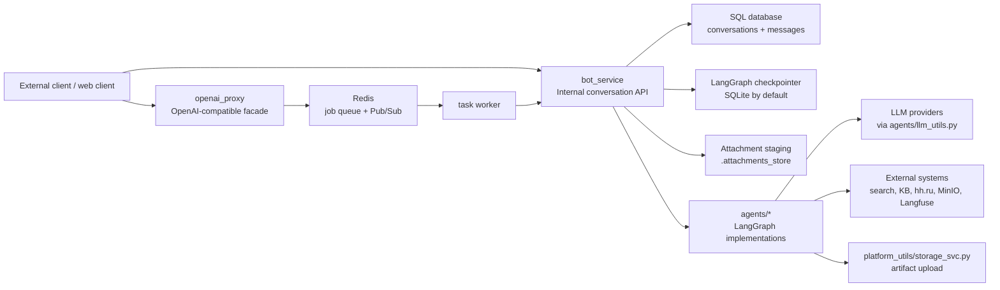

# Platform Principles And Topology

Back to the [documentation index](../index.md).

## Source-of-truth scope

This section is based primarily on:

- `bot_service/main.py`, `bot_service/api/*`, `bot_service/service.py`, `bot_service/attachments.py`
- `openai_proxy/main.py`, `openai_proxy/schemas.py`, `openai_proxy/utils.py`
- `services/task_queue/*`
- `agents/*`, `agents/utils.py`, `agents/llm_utils.py`
- `.env`, `data/load.json`, `models.toml`

## Architectural principles

- Configuration drives exposure.
  - Agents are registered from `data/load.json` through `BOT_SERVICE_AGENT_CONFIG_PATH`; implementation folders and exposed agent IDs are intentionally separate concepts.
- Platform boundaries are explicit.
  - `bot_service` owns conversations and synchronous invocation.
  - `openai_proxy` owns OpenAI-compatible request/response shaping.
  - `services/task_queue` owns asynchronous orchestration and streaming of job events.
- Conversation persistence is distinct from agent checkpointing.
  - SQLAlchemy stores conversation and message history; LangGraph checkpoint savers store agent execution state.
- Attachments are normalized at the boundary.
  - `bot_service` classifies, converts, persists, or forwards attachments before they reach an agent graph.
- Long-running work is streamable.
  - Proxy jobs move through queue stages and can emit status pulses, heartbeats, content chunks, and interrupt events.
- Shared agent behavior is standardized.
  - Most agents expose `initialize_agent(...)`, compile a `StateGraph`, attach tracing callbacks, and accept `RunnableConfig.configurable`.

## Runtime topology

## Component responsibilities

- `bot_service`
  - Initializes the database, preloads active agents, exposes `/api/*`, normalizes messages, processes attachments, and invokes agent graphs.
- `agent_registry`
  - Loads agent definitions from config, tracks init lifecycle, exposes ready agents, and passes stream-mode metadata to `bot_service`.
- `openai_proxy`
  - Accepts `/v1/models` and `/v1/chat/completions`, hydrates attachment inputs, creates or reuses conversations, enqueues jobs, and maps queue events to JSON or SSE.
- `RedisTaskQueue`
  - Stores queue items, job status hashes, active-job scores, and Pub/Sub events.
- `task worker`
  - Dequeues jobs, calls `bot_service`, streams chunks, updates heartbeat timestamps, and finalizes results or failures.
- `agents/*`
  - Execute business logic. Most are LangGraph graphs built from smaller nodes or nested subgraphs.
- `platform_utils/*`
  - Supplies JSON trace logging, artifact upload links, and periodic background-task support.

## Service boundaries

- Synchronous path
  - A caller can use `bot_service` directly and get a single HTTP response that already includes the persisted user and assistant messages.
- Asynchronous path
  - A caller can use `openai_proxy`; the proxy delegates to Redis and the worker, then returns either SSE or a final JSON completion.
- Agent boundary
  - Agents do not own HTTP or database semantics. They receive messages and `configurable` runtime context and return messages, attachments, or interrupts.

## Operational constraints

- Ready-state exposure is conservative.
  - `/api/agents/` and `/v1/models` show only agents that are initialized and ready.
- Initialization is lazy and preload-assisted.
  - `bot_service` calls `agent_registry.preload_all()` on startup, but individual conversations still handle `pending` states.
- Attachments follow agent capability declarations.
  - `supported_content_types` and `allow_raw_attachments` determine whether files are converted to text, passed through, or rejected.
- Proxy compatibility is intentionally narrow.
  - `openai_proxy/utils.py` reduces chat history to the latest user text for the prompt payload while preserving raw user text and latest attachments for bot-side handling.
