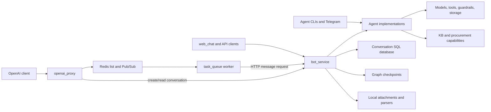
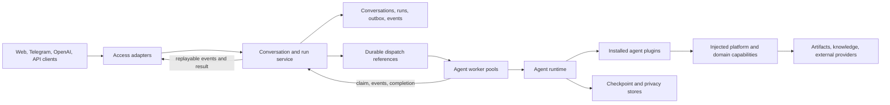

# Platform architecture review and refactoring plan

Date: 2026-10-04. Baseline: commit `9f54d89b` plus the existing working-tree changes.

Status: proposal based on the checked-out implementation. No application code was changed for this review.

## 1. Recommendation

Keep one repository initially and establish six responsibility boundaries: **agent implementations, agent runtime, shared capabilities, conversation/run application services, access adapters, and infrastructure**. Package these boundaries before separating their deployments. Agents should be plugins hosted by a runtime; client-facing APIs should not import or initialize them.

The most important change is execution ownership. Today, the queue worker calls `bot_service` over HTTP, and `bot_service` executes the agent. Adding worker replicas therefore does not move agent execution out of the API process. The target worker must execute the runtime directly, while the application service owns conversations, accepted requests, run state, and result persistence.

Use `simple_agent` as the first migration pilot, then an interrupt/artifact agent, then retrieval and delegated agents. Keep iSmart batch generation in its own workload class. Preserve current agent IDs, configuration variants, prompts, and public response formats through adapters while changing the internals.

This plan assumes package boundaries first, selective independent deployment second. Separate repositories are a later organizational decision; they would make the current dependency cycles harder to untangle.

## 2. Scope and confidence

The review covered the first-party Python packages, root entry points, three Python scripts, service configuration code, the default local agent manifest, tool registrations, deployment definition, test organization, and existing platform/guardrail architecture documents. A structural scan parsed **380 Python files / 118,219 lines**, including tests, legacy code, and local working-tree additions. The initial application/package/root/test inventory contained 377 files; three scripts added 8,801 lines. These are source-size measures, not complexity or coverage scores.

Targeted manual inspection traced registration, initialization, agent invocation, conversation persistence, streaming, queue delivery, attachments, retrieval, tool injection, checkpoints, and client adapters. This is a repository-wide architectural review, not an assertion that every business rule or every source line has been behaviorally verified.

Excluded: secret env-file contents, user databases, document corpora, generated lesson output, installed dependency source trees, production deployment state, live provider calls, and exhaustive agent-quality evaluation. The inspected default local manifest has **34 IDs, 17 active entries, and 19 distinct implementation module paths**; deployed configurations can differ. Existing iSmart modifications were preserved.

| Area | Observed scale | Architectural role |
| --- | ---: | --- |
| `agents/` | 191 Python files / 56,935 lines | Business agents mixed with reusable capabilities and Telegram clients |
| `bot_service/` | 15 / 2,625 | HTTP, application logic, persistence, registry, runtime, attachments |
| `openai_proxy/` | 7 / 1,096 | Access protocol plus job orchestration |
| `services/` | 33 / 5,489 | Queue relay, KB service, procurement retrieval, shared HTTP client |
| `platform_guardrails/`, `platform_tools/`, `platform_utils/` | 21 / 6,897 | Existing shared foundations worth retaining |
| `generators/` | 15 / 2,546 | Separate batch-generation runtime |
| `packages/gaz_index_builder/` | 4 / 1,230 | Existing independently packaged capability |
| `tests/` | 40 Python files, including conftest | 612 statically identified test functions; not a runtime pass count |

The existing [platform survey](../findings.md), [runtime descriptions](runtime-flows.md), [MCP tool gateway decision](platform-mcp-tool-gateway-design.md), and [guardrail status](../../guardrails/implementation_status.md) informed this review. Proposed boundaries below extend those decisions. In particular, retain the MCP decision that tool policy belongs to the platform, transport is an adapter, and agent-specific state mutation tools stay local.

## 3. Current architecture



There are several execution paths with different ownership:

1. **OpenAI:** proxy creates/reads a conversation, hydrates attachments, enqueues a job; worker calls the conversation API; API executes the graph and saves messages; worker republishes events; proxy maps them to SSE or a completion.
2. **Native REST / web chat:** call the conversation API directly and bypass the Redis job lifecycle.
3. **Agent CLIs / Telegram:** construct or load agents locally, with their own initialization and state choices.
4. **Procurement retrieval:** an HTTP service and DB worker already exist, but both depend on implementation classes inside the sales agent.
5. **KB / GAZ:** HTTP endpoints coexist with direct in-process imports, shared index paths, and process-local reload callbacks.
6. **Generation:** the registered iSmart graph and `generators/ismart_materials_agent` expose different execution contracts. They should not be merged solely because they have similar names.

The repository has useful foundations: configuration-driven variants, a common factory convention, a shared tool registry, reusable guardrail middleware, a graph specification/compiler pilot, and an HTTP procurement client with separate persistence. The refactor should build on these.

## 4. Prioritized findings

Priorities describe migration order: **P1** must be resolved before independent runtime replicas are considered reliable; **P2** belongs in staged extraction; **P3** is follow-up consolidation. Static consequences below are distinguished from reproduced behavior.

### F1 — P1: execution still belongs to the API process

The worker invokes `BotServiceClient.send_message[_stream]`; graph execution happens in `bot_service.service`. The registry, factories, checkpoints, and agent initialization all sit behind API startup. Native REST calls bypass the queue entirely.

**Consequence:** queue, API, and agent scaling are coupled; workers relay long-lived HTTP requests instead of owning execution. Two public paths have different scheduling and failure semantics.

**Action:** extract a runtime independently of HTTP and give all channels one `SubmitRun` application operation. Retain synchronous responses as waiting views over a run. Move actual runtime execution into workers after durable run ownership exists.

Evidence: [worker](../../../services/task_queue/worker.py#L108), [invocation](../../../bot_service/service.py#L180), [stream invocation](../../../bot_service/service.py#L369), [API startup](../../../bot_service/main.py#L13).

### F2 — P1: queue dequeue has no recovery ownership

`pop_job` uses `BLPOP`, removing the payload before processing. Active-job registration happens later in the worker. Enqueue also writes status, expiration, and the list separately. The watchdog fails stale registered jobs; it does not reclaim an unacknowledged delivery.

**Consequence:** a crash after pop and before registration can strand a queued status with no remaining payload. A later crash can mark a job failed without establishing whether its external effects already happened. There is no general retry/idempotency contract.

**Action:** introduce persisted runs, reliable dispatch, atomic claims with leases, attempt IDs, and idempotency keys. Use a durable notification/acknowledgment mechanism or a DB-backed claim mechanism. Do not promise exactly-once tool effects; classify retryable work and deduplicate side effects explicitly.

Evidence: [enqueue](../../../services/task_queue/redis_queue.py#L59), [pop](../../../services/task_queue/redis_queue.py#L171), [worker processing](../../../services/task_queue/worker.py#L68).

### F3 — P1: late subscribers can miss completion

The proxy enqueues before it subscribes. `wait_for_completion` only consumes Pub/Sub events. The streaming iterator can emit a `status=completed` snapshot, but it then continues waiting for a terminal event already published. The proxy's fallback after iteration does not help when the iterator never ends.

**Verified:** a local probe using the real queue methods with a fake empty Pub/Sub transport and an already-completed status reproduced both a non-streaming timeout and a streaming iterator with no terminal event. This was not a live Redis integration test.

**Action:** fix terminal snapshot handling promptly, including interrupted and failed states. For the target design, persist ordered run events and support replay from a sequence cursor; Pub/Sub may be a wakeup mechanism, not the record of completion. Subscribe/snapshot reconciliation must close the race, rather than just adding an earlier status read.

Evidence: [enqueue then wait](../../../openai_proxy/main.py#L574), [iteration and completion waiting](../../../services/task_queue/redis_queue.py#L190), [proxy stream handling](../../../openai_proxy/main.py#L308).

### F4 — P1: conversation ordering and state commits are inconsistent

Non-streamed requests acquire a conversation row lock before invoking the agent and retain the transaction through inference. Streamed requests read without that lock, roll back before inference, and only lock to persist the final result. Both paths save the user message after successful execution. Graph checkpoints are managed separately from conversation SQL; `thread_id` is the conversation ID.

**Consequence:** non-streamed inference holds a database transaction for a long period, while concurrent streamed turns can operate on the same graph thread. An inference failure can leave no accepted user message in conversation history; a persistence failure can disagree with an already-advanced checkpoint. These risks follow from the code; concurrent production behavior was not load-tested.

**Action:** persist the input and run before execution, serialize root runs per conversation using a durable lease/sequence policy, and persist completion once per run. Keep DB transactions short. Add explicit checkpoint references and reconciliation; SQL and checkpoint storage are not one atomic transaction.

Evidence: [row-lock choice](../../../bot_service/api/conversations.py#L234), [stream rollback](../../../bot_service/api/conversations.py#L318), [late lock](../../../bot_service/api/conversations.py#L373), [message persistence](../../../bot_service/api/conversations.py#L57), [thread configuration](../../../bot_service/service.py#L160).

### F5 — P1: catalog metadata imports every configured implementation

Registry construction imports factories while parsing every entry, including inactive entries, before the active-only preload filter runs. The registry is instantiated at module import. `ModelType` comes from `agents.utils`, which imports model and Telegram helpers. A metadata/API import can therefore pull in agent dependencies and global configuration.

The default local manifest and `uv.lock` exist locally but are not tracked in this checkout. `.gitignore` excludes them. A clean clone cannot reproduce this machine's catalog and dependency resolution from those files.

**Action:** separate a serializable `AgentCatalog` from `AgentLoader` and `AgentInstancePool`. Parse/list manifests without importing implementation modules; load only selected plugins in workers. Version non-secret manifests and a reproducible lock/build specification. Validate disabled-agent policy on submission, not only in listings.

Evidence: [factory import](../../../bot_service/agent_registry.py#L313), [registry construction](../../../bot_service/agent_registry.py#L347), [preload filter](../../../bot_service/agent_registry.py#L652), [shared enum imports](../../../agents/utils.py#L1), [.gitignore](../../../.gitignore).

### F6 — P2: dependency direction is inverted in several concrete places

| Current dependency | Why it prevents extraction | Intended boundary |
| --- | --- | --- |
| Mycroft subagent loader → `bot_service.agent_registry` and its private `_definitions` | A business plugin imports its host/API registry | Inject an `AgentResolver`/delegation interface |
| Retrieval API and worker → `agents.sales_lead_agent.tools` | Independently deployed support service requires business-agent implementation | Extract procurement models and services; keep thin agent tool adapters |
| KB service/embeddings → `agents.retrievers.utils.models_builder` | Infrastructure/model creation is owned by the agent tree | Capability-owned embedding provider |
| Tool config → `agents.user_info`, `agents.retrievers`, `agents.tools` | Dynamic import strings hide platform-to-agent dependencies from ordinary import checks | Move reusable implementations; update manifest paths |
| GAZ local client → `services.kb_manager.gaz_runtime` | A plugin imports a service implementation | Shared GAZ capability interface plus local/HTTP adapters |

The sales `tools.py` contains 5,541 lines spanning request schemas, workspace management, crawling, document preparation, counterparty clients, procurement SQL, and LangChain wrappers. Its extraction should follow those responsibilities, not arbitrary file-size splits.

Evidence: [Mycroft](../../../agents/mycroft_agent/subagent_loader.py#L14), [retrieval API](../../../services/sales_lead_retrieval/api.py#L9), [retrieval worker](../../../services/sales_lead_retrieval/worker.py#L9), [KB embeddings](../../../services/kb_manager/service.py#L455), [configured tools](../../../platform_tools/tools.json), [GAZ adapter](../../../agents/gaz_agent/gaz_marketing_tools.py#L61).

### F7 — P1: state and file ownership assume local execution

Raw attachment metadata contains server filesystem paths. The API calls synchronous extraction in its async request handler. Procurement snapshots are JSON files read/written alongside DB metadata. KB document metadata and reload listeners live in memory. Several agents default to `MemorySaver`; the service's supported shared checkpoint path is SQLite, while unsupported checkpoint names are logged and skipped. Privacy session objects are also kept in a process-local dictionary.

**Consequence:** placing workers on another machine or routing a resumed conversation to another process can lose access to files or state unless deployment-specific sharing is supplied. Process-local callbacks do not themselves notify a separately running service.

**Action:** define artifact IDs and storage adapters, put ingestion outside request handling, give one component ownership of each index, and make checkpoint/privacy continuity part of worker placement. Keep local adapters for development. Introduce durable index-version notifications or polling before assuming reload works across processes. Preserve Palimpsest as the existing reversible privacy mechanism; validate session persistence or retain explicit affinity until continuity is proven.

Evidence: [attachment handling](../../../bot_service/api/conversations.py#L265), [raw paths](../../../bot_service/api/conversations.py#L293), [retrieval snapshots](../../../services/sales_lead_retrieval/store.py#L29), [KB metadata](../../../services/kb_manager/service.py#L68), [reload broadcaster](../../../services/kb_manager/notifications.py#L35), [checkpoint selection](../../../bot_service/agent_registry.py#L444), [privacy sessions](../../../platform_guardrails/privacy.py#L228).

### F8 — P2: protocol compatibility and runtime events are mixed

The proxy manages conversations, job scheduling, attachment hydration, readiness polling, and protocol formatting. Its prompt builder forwards only the latest user text; system and historical messages are collected but not included. This is documented as narrow compatibility, so changing it silently during refactoring would be a behavior change. Runtime custom events are republished by the worker, but the proxy stream has no `custom` branch.

**Action:** make the proxy a translation adapter over run/conversation APIs. Publish a compatibility matrix for stateful conversations versus standard stateless chat history, custom progress, errors, usage, attachments, and unsupported fields. Preserve existing behavior in the compatibility adapter; offer corrected/expanded semantics through an explicit version or mode. Validate model ID against an existing conversation's pinned agent.

Evidence: [prompt semantics](../../../openai_proxy/utils.py#L21), [proxy orchestration](../../../openai_proxy/main.py#L431), [stream event mapping](../../../openai_proxy/main.py#L316), [native schemas](../../../bot_service/schemas.py).

### F9 — P2: lifecycle, cancellation, and deadlines have no single owner

`AgentRegistry.aclose()` exists, but the API lifespan does not invoke it. Stream execution launches an untracked task with an unbounded queue. `BotServiceClient` accepts a timeout argument but configures an unlimited read timeout; the worker's elapsed-time check emits a warning. A relay heartbeat proves the relay is alive, not that the graph is making progress.

**Action:** give runtime instances a managed async lifecycle, bounded event buffering, explicit run deadlines and cancellation, and per-run execution heartbeats. Specify whether client disconnect detaches or cancels; recommended default is detach with a separate cancel operation. Cancellation of threads/tools must be cooperative or process-isolated; canceling an asyncio task alone cannot guarantee an external effect stops.

Evidence: [close method](../../../bot_service/agent_registry.py#L424), [lifespan](../../../bot_service/main.py#L13), [background stream task](../../../bot_service/service.py#L395), [client timeouts](../../../services/bot_client.py#L64), [worker](../../../services/task_queue/worker.py).

### F10 — P1: independently deployable boundaries lack a reproducible build

Compose bind-mounts the checkout, runs Git pull at startup, and installs the same broad project dependencies in the API, relay worker, and proxy. The dependency set includes inference, retrieval, document conversion, Telegram, and UI-independent libraries together, plus an editable `../forks/llm-guard` source outside the repository. Both SQL services bootstrap with `create_all`; no tracked migration files or CI workflow surfaced in the inspected paths.

**Action:** build immutable component images with frozen dependencies and explicit resources. Remove startup code updates/installations from deployment. Isolate dependency sets by component, provide a reproducible source for the local fork, and add versioned migrations with expand/contract rollout. Keep a simple development Compose profile, with explicit external-service prerequisites where they are not included.

Evidence: [Compose](../../../docker-compose.yml#L3), [dependency definition](../../../pyproject.toml), [conversation DB setup](../../../bot_service/db.py#L43), [retrieval DB setup](../../../services/sales_lead_retrieval/db.py#L38).

### F11 — P2: identity and policy need a stable service boundary

The conversation API builds identity from caller-supplied headers, defaulting to anonymous. The proxy derives identity from request `user` or a default. This may be intentional behind a trusted gateway, but that trust is not established by these handlers. Tool policy and redacted tracing already exist, but adoption differs across agents.

**Action:** document the trusted ingress and inject a validated principal into application and runtime context. External body fields must not become authorization credentials. Preserve conversation ownership checks, apply artifact ownership checks, and carry request/run/parent-run IDs through policy and audit. Keep authentication at ingress, authorization in application/capability operations, and model/tool guardrails in the execution path.

This is a boundary finding, not a penetration-test result or a claim about the deployed gateway.

Evidence: [identity dependency](../../../bot_service/api/deps.py#L20), [proxy identity](../../../openai_proxy/main.py#L435), [guardrail implementation status](../../guardrails/implementation_status.md).

### F12 — P2/P3: duplicate implementations and old paths complicate ownership

The two 1,024-line `gaz_runtime.py` files under the KB service and packaged index builder are byte-for-byte identical. GAZ service code therefore has two maintenance locations. There are multiple provider enums and multiple loading paths; `agents.agent_loader` is explicitly deprecated but is still a fallback for subagent loading. Telegram lives inside `agents/`, and legacy-looking modules include unresolved import paths such as `agents.agent` in Telegram thread settings.

**Action:** make the packaged GAZ capability canonical, keep temporary re-exports, move channel code out of agents, and inventory which legacy paths still have consumers before retiring them. Consolidate configuration and initialization through the new runtime. Do not delete `old`/`new` agent families based on their names.

Evidence: [service copy](../../../services/kb_manager/gaz_runtime.py), [package copy](../../../packages/gaz_index_builder/src/gaz_index_builder/gaz_runtime.py), [deprecated loader](../../../agents/agent_loader.py#L3), [Telegram thread settings](../../../agents/tg_bots/thread_settings.py#L2).

### F13 — P2: regression coverage is concentrated below the service boundary

There is substantial agent and guardrail unit coverage. The inspected service tests cover three worker cases, two message/stream cases, and fifteen registry/tool cases, but no dedicated native API/proxy end-to-end or Redis recovery suite surfaced. README still describes testing as manual, and older registry docs describe product auto-discovery that the current config loader does not implement.

**Action:** retain existing tests, add behavior characterization at service boundaries, add package dependency checks, and align docs with the current manifest loader. Test installed packages without the repository root on the import path; source-tree tests alone cannot verify package independence.

Evidence: [tests](../../../tests/unit/), [README testing text](../../../README.md#L309), [older registry description](../../../services.md#L41), [current config loader](../../../bot_service/agent_registry.py#L243).

## 5. Target responsibilities

Here, a capability is a reusable library or service operation. It does not automatically require its own network service.

| Boundary | Owns | Must not own |
| --- | --- | --- |
| **Agent implementations** | Business prompts, graph/state design, domain decisions, domain-specific validation, local state-mutating tools | HTTP routing, queue internals, conversation SQL, platform globals, discovery of host-private registries |
| **Agent runtime** | Plugin loading, instance lifecycle, invocation/stream/resume/reset adapters, checkpoint access, delegation, deadline/cancel enforcement | Client protocol formatting or conversation ownership policy |
| **Shared capabilities** | Model factories, tool execution/policy, retrieval, ingestion, artifact storage/rendering, privacy/guardrails, tracing, external integrations | Agent prompts and graph-specific business transitions |
| **Application services** | Catalog visibility, principals/authorization, conversations/messages, accepted runs, scheduling policy, ordering, interrupts, result projection | LangGraph implementation details, model SDKs, Redis operations in business rules |
| **Access adapters** | Native REST, OpenAI compatibility, web/Telegram presentation, remote client SDK, optional platform MCP transport | Agent construction or alternate run lifecycle implementations |
| **Infrastructure and composition** | SQL repositories, queue/event storage, blob stores, process entry points, settings, dependency injection, migrations/deployment | Domain decisions disguised as generic helpers |

Reusable procurement components should remain a **domain capability**, not become mandatory dependencies of all agents. Likewise, GAZ document retrieval and KPI reporting should have their own interfaces. General model/storage/ingestion mechanisms can be shared without forcing unrelated agents into a universal domain model.

### Initial package layout

Names below are proposed; existing import paths can remain as temporary facades during migration. Do not create a top-level package named `platform`, which collides with Python's standard library.

```text
apps/
  api/                       # native API + conversation/run application host
  openai_gateway/            # protocol translation; calls application API
  agent_worker/              # executes agent_runtime
  knowledge_service/         # existing KB service host
  procurement_service/       # existing retrieval API + worker entry points
  web_chat/
  telegram/
  platform_mcp/              # only when implementing the existing MCP design

packages/
  bot_contracts/             # serializable requests, events, errors, descriptors
  agent_sdk/                 # plugin interfaces, context, capability ports
  bot_application/           # conversation/run use cases and persistence ports
  agent_runtime/             # loader, lifecycle, framework adapters, delegation
  platform_capabilities/     # model/storage/ingestion/observability modules
  platform_infrastructure/   # SQL, dispatch/event, storage adapter wiring
  platform_tools/            # retain existing ownership; package incrementally
  platform_guardrails/       # retain existing ownership; separate framework adapters
  platform_client/           # HTTP clients using bot_contracts
  procurement/               # procurement domain models and implementation
  gaz_index_builder/         # canonical GAZ indexing/retrieval implementation

agents/
  simple_agent/              # separately installable plugin; prompts/state/tools
  artifact_creator_agent/
  ...

jobs/
  ismart_materials/          # batch entry point over its own domain implementation
config/                     # versioned non-secret manifests and policy defaults
deploy/                     # image definitions, Compose profiles, migrations
tests/
  unit/
  contracts/
  integration/
  architecture/
```

This is an end-state map, not an instruction to create every directory immediately. Begin with `bot_contracts`, `agent_sdk`, `agent_runtime`, and the application extraction. Keep capability submodules together until dependency weight or release ownership justifies another package. Keep prompts, templates, locales, and schema resources in the plugin distribution rather than relying on repository-relative paths.

### Dependency rules

1. `bot_contracts` imports only lightweight serialization/typing dependencies. No FastAPI, SQLAlchemy, Redis, LangGraph, or model providers.
2. `agent_sdk` depends on contracts; its optional framework extensions may depend on LangGraph/LangChain. Plain contracts must stay framework-independent.
3. `bot_application` depends on contracts and its own abstract ports. Concrete runtime/storage/transport implementations are injected at composition roots.
4. Runtime and capability implementations depend on contracts/SDK. They do not import access applications or concrete business-agent modules. Runtime resolves plugin entry points dynamically by a validated catalog entry.
5. Agents depend on the SDK and declared domain libraries; new shared integrations enter through capability interfaces. Domain-local tools remain local.
6. Access adapters use application interfaces or `platform_client`. They cannot import agents, model factories, checkpoints, or queue implementation classes.
7. Concrete infrastructure implements ports owned by its consumers. Entrypoint composition code may import both sides; business modules may not.
8. Check dynamic manifests as well as Python imports. Configured tool paths and plugin entry points are dependency edges too.

## 6. Contracts and state ownership

### Minimum contracts

| Contract | Essential fields/operations |
| --- | --- |
| `AgentDescriptor` | Stable ID, implementation/version, SDK compatibility, settings schema, supported inputs, streaming/resume/reset/batch capabilities, required tools/capabilities, lifecycle scope |
| `AgentContext` | Validated principal, conversation ID, run ID, parent-run ID, deadline, locale, trace context, scoped capability handles |
| `AgentPlugin` | Explicit create/close lifecycle and invoke/events interface; LangGraph adapter supports current factories during migration |
| `RunRequest` | Schema version, run/attempt ID, pinned agent revision, operation (`message`, `resume`, `reset`, `batch`), typed input, artifact references, idempotency key, deadline |
| `RunEvent` | Schema version, event ID, run/attempt ID, monotonic sequence, timestamp, typed payload; separate text delta, progress, artifact, waiting-for-input, completed, failed, cancelled |
| `RunResult` | Final output, artifact IDs, usage when available, typed error or interrupt, checkpoint reference; no raw graph objects |
| `ArtifactRef` | Stable ID, media type, size/hash, ownership, storage key; authorized download resolved at the boundary |
| `AgentResolver` | Resolve/invoke a child agent by catalog ID and explicit child-state scope; no private registry inspection |

Do not send callables, compiled graphs, arbitrary `RunnableConfig`, or local absolute paths across process boundaries. Map framework objects inside the framework adapter. Preserve old wire DTOs with explicit translators; do not make the public OpenAI schema the domain model.

A descriptor is metadata; a deployment variant binds it to model selection, capabilities, and policy. This preserves several exposed IDs sharing one implementation. Load settings against a declared schema; report unknown/unsupported settings instead of silently filtering them. Tool injection must declare additive versus replacement behavior, consistent with the existing MCP design.

### Durable ownership

| State | Authoritative owner | Migration rule |
| --- | --- | --- |
| Conversations and messages | Conversation application service | Keep IDs; persist accepted input before execution; completion projection deduplicated by run |
| Run state, attempts, ordering, interrupts | Run application service | One transition authority; durable claims/leases and compare-and-set terminal transitions |
| Dispatch intent | Run service outbox | Created atomically with accepted run; queue holds delivery references |
| Ordered run events and final result | Run service/event repository | Persist before publishing; unique event IDs/sequence; bounded retention with terminal result retained |
| Graph checkpoints | Runtime checkpoint adapter | Namespace by conversation/agent revision/child scope; keep old sessions on a compatible runtime |
| Privacy restoration sessions | Guardrail/privacy capability | Prove continuation after restart/relocation or pin session routing until migration is available |
| Attachment/artifact bytes | Artifact storage capability | Replace server paths with IDs; local adapter in development, shared store for separate hosts |
| KB source metadata and index versions | Knowledge capability/service | One writer for each index; immutable/versioned publication or coordinated updates |
| Procurement jobs and domain cache | Procurement service | Preserve existing separate DB ownership; replace shared-path assumptions |

### Run lifecycle

```text
accepted -> queued -> running -> completed
                         |----> failed
                         |----> cancelled
                         `----> waiting_input

waiting_input -- validated resume --> queued (new attempt, same logical run)
```

Only the run service commits lifecycle changes. Workers use an internal run-coordination contract to claim, renew a lease, append event batches, and complete/fail an attempt. Initially this can be an in-process application interface; after deployment separation it becomes an authenticated internal client. Workers do not write conversation tables directly.

Recommended invariants:

- One active root run per conversation unless the agent explicitly supports parallel independent branches. Choose a consistent queue-or-conflict policy across transports.
- Child invocations belong to the parent run and use explicit checkpoint namespaces. They must not deadlock by acquiring the parent's root-run lease again.
- Input/run/outbox creation occurs in one SQL transaction. Dispatch can repeat safely using the same run ID.
- Lease expiry permits recovery only under a declared retry policy. A fencing token prevents stale workers from committing a terminal result; it cannot undo an already-performed external effect.
- Each attempt has at most one accepted terminal outcome. Result projection is idempotent; event notification can be delivered more than once.
- Completion follows durable result storage. A reconnect retrieves terminal state even when intermediate deltas have expired.
- Resume validates the pending interrupt and principal; reset coordinates transcript, checkpoint, and privacy-session policy. Duplicate resume/reset requests do not execute twice.
- Checkpoint/result disagreement is recoverable using a recorded checkpoint reference and reconciliation. Do not assume a distributed transaction across graph and SQL stores.

## 7. Deployment after the package split



Start with a small number of deployable units:

- **Conversation/run API:** control and persistence; no agent imports, model SDKs, OCR, or GPU stack.
- **Agent worker pool:** runtime plus explicitly selected plugins. Separate interactive and long-running batch pools where their latency/resource needs differ.
- **Access gateways:** retain the existing OpenAI gateway process if useful; the native API can share the application host. Web and Telegram use the same client contract.
- **Knowledge/procurement workers and APIs:** retain their existing service boundaries, correct their code/data ownership, and isolate expensive parsing/indexing.

Model factories, guardrails, tool registration, and storage adapters can remain libraries. A dedicated model or tool network service is justified by centralized credentials/policy, independent resource needs, or multiple external consumers—not by the existence of a folder. The existing MCP tool gateway is an optional capability-access adapter and is distinct from the APIs that invoke agents.

Scaling gates: no shared writable local attachment paths; durable root-run ordering; checkpoint/privacy continuity; worker claim recovery; API readiness independent of any individual plugin; plugin-specific readiness visible to the scheduler; reproducible image dependencies; clean startup/shutdown with no orphan execution.

## 8. Concrete extraction map

| Current source | Destination / split |
| --- | --- |
| `bot_service/schemas.py`, queue DTOs | Shared neutral types → `bot_contracts`; HTTP response schemas stay with access adapters |
| `bot_service/agent_registry.py` | Metadata parser → catalog; imports/instances → runtime; provider/tool/checkpointer wiring → composition |
| `bot_service/service.py` | `agent_runtime.langgraph` message/invocation/event adapter |
| `bot_service/api/conversations.py` | HTTP handlers → API; accepted-input/run/result logic → `bot_application`; SQL operations → repositories |
| `bot_service/models.py`, `db.py` | Conversation/run infrastructure plus explicit schema migrations |
| `services/task_queue/redis_queue.py` | Dispatch/event adapter; authoritative run state moves out of ephemeral Redis hashes |
| `services/task_queue/worker.py` | Worker lifecycle + runtime invocation; remove the HTTP loop through message submission |
| `services/bot_client.py`, proxy client re-export | `platform_client`; explicit settings and lifecycle |
| `agents/utils.py`, `llm_utils.py`, `state/state.py` | Pure enums/context → contracts/SDK; model factories → capabilities; Telegram formatting → channel; framework helpers → runtime adapter |
| `agents/structured_prompt_utils.py` | Optional SDK/framework support library |
| `agents/tools/`, `user_info.py`, `store_artifacts.py`, `platform_utils/` | Platform capability implementations and tool adapters; rendering separate from blob upload |
| `platform_tools/`, `platform_guardrails/` | Retain and package; split pure policy/specification from framework wiring and heavy scanner imports |
| `agents/retrievers/`, KB loaders/embeddings | Retrieval/ingestion capability library; service host calls it; agents use ports/adapters |
| Sales `tools.py` | Procurement domain models, workspace/crawler/index services, counterparty clients, thin agent tools; API/worker depend on domain package |
| Two GAZ runtime copies | One canonical packaged implementation; service and build CLI import it |
| Mycroft subagent loader | Runtime-injected resolver; explicit stateless/stateful child invocation policy |
| `agents/tg_bots/`, `run_bot.py`, `web_chat/` | Channel applications over `platform_client`; local agent construction removed from normal channel use |
| `generators/ismart_materials_agent/`, registered iSmart agent | Distinct adapters over their domain logic; prove behavioral equivalence before sharing implementations |
| Root agent CLIs/simulations | Developer clients using runtime composition or remote API; organize under named commands/examples |
| Root `config.py`, service settings, `models.toml` | Typed component settings; non-secret defaults/config resources versioned; secrets resolved only at composition |
| `user_manager/`, `store_managers/`, `utils/`, `vrecog/`, `anonimization/` | Assign to identity/integration/channel/media/privacy capabilities by actual consumers; avoid a new undifferentiated `utils` bucket |
| Data, outputs, logs, attachment directories | Runtime-managed storage roots; leave existing content intact and migrate by manifest/reference |

Do not combine mechanical relocation, dependency upgrades, prompt changes, and checkpoint schema changes in one patch. Temporary re-export modules should have explicit consumers and removal gates.

## 9. Migration sequence and acceptance gates

Each phase should be reviewable and deployable without requiring all agents to migrate at once. The early reliability fixes can land independently of package relocation.

| Phase | Deliverables | Exit criteria | Rollback / containment |
| --- | --- | --- | --- |
| **0. Establish baseline** | Version non-secret manifest example; classify active/dev/legacy paths; repair test environment; record existing wire fixtures; document storage locations and current consumers | Existing behavior fixtures and selected test suite run reproducibly; no real provider calls in ordinary tests | Documentation/test-only changes; preserve existing outputs and env configuration |
| **1. Correct delivery edges** | Terminal snapshot/race handling; explicit disconnect/deadline semantics; regression cases for already-finished jobs; lifecycle cleanup | Fast finish, failed/interrupt snapshots, cancellation/detach, and shutdown checks pass; no duplicate terminal response | Isolated fixes on current topology; avoid automatic retries before idempotency exists |
| **2. Contracts and metadata catalog** | `bot_contracts`, `agent_sdk`; pure manifest parser; plugin capability/settings schema; lazy loader; move pure provider enum | List/validate catalog with no agent packages installed; inactive/missing optional plugins do not break API import; old public IDs unchanged | Legacy manifests translated explicitly; retain compatibility exports |
| **3. Runtime and application extraction** | LangGraph runtime adapter; instance lifecycle; use cases/repositories behind existing HTTP routes; `simple_agent` pilot | CLI and API use the same factory/runtime behavior; API handlers have no graph calls; injection preserves tools, guardrails, prompts, streaming and resume | Keep existing route URLs; per-agent runtime selection fixed for each conversation |
| **4. Shared capability and cycle removal** | Models/storage/ingestion ports; procurement extraction; canonical GAZ package; Mycroft resolver; channel separation | Dependency checks reject platform imports of concrete agents, including tool config; support service installs/tests without agent tree | Temporary old import facades; each domain extracted separately with existing fixtures |
| **5. Durable runs and state migration** | Runs/attempts/events/outbox; claim/lease/fencing; conversation ordering; artifact references; interrupt/resume/reset; versioned DB migrations | Crash/retry/duplicate/reconnect/concurrent-turn integration tests pass; accepted input and final result survive API/worker restart | Additive schema changes; route new conversations to new execution path; pin old conversations to old runtime until drained |
| **6. Execute in worker pools** | Workers run runtime directly; application coordinator client; API no longer imports agent runtime; independent images; batch pool | Restart API without losing execution; restart worker with defined recovery; API-only image excludes model/OCR/Telegram stacks; two-worker ordering passes | Feature flag by agent/new conversation; drain runs before rollback; preserve checkpoint version compatibility |
| **7. Simplify access and retire facades** | Thin OpenAI/REST/channel adapters; documented compatibility mode; optional MCP transport over existing tool core; remove unused loaders and copies; update docs | Every supported channel submits through one run contract; old-path import checks clean; staged production metrics within agreed limits | Keep versioned public adapters through the announced compatibility window; retire only after usage evidence |

Phases 2–4 can begin while reliability fixes are being validated. Phase 6 is gated by Phase 5, artifact portability, and checkpoint/privacy continuity. Avoid horizontal scaling as a substitute for those prerequisites.

### Suggested first pull requests

1. **Review baseline and characterization:** catalog fixtures, input/output/event fixtures, environment diagnosis, dependency-boundary inventory; documentation updates.
2. **Completion delivery repair:** terminal snapshot reconciliation plus tests for publication before subscription; retain existing wire shape.
3. **Contracts/catalog extraction:** move neutral descriptors/types, parse manifests without factory imports, introduce explicit validation of active status and settings.
4. **Runtime pilot:** extract existing graph invocation and lifecycle, migrate `simple_agent`, preserve graph/compiler/guardrail semantics with regression tests.
5. **Application use cases:** accepted-input/run interface behind current routes; repositories and short transactions; keep current execution adapter until durable dispatch is ready.

Proceed to procurement/GAZ/delegation extraction and durable-run rollout after these interfaces are stable. No time estimate is attached without knowing the deployment constraints, team capacity, and required compatibility window.

### Per-agent migration order

| Wave | Candidates | What it validates |
| --- | --- | --- |
| A | `simple_agent`, then `simple_agent_en` | Graph-spec path, tool injection, platform/disabled guardrails, variant IDs |
| B | `artifact_creator_agent`, a tutor/ideator using raw attachments | Interrupt/resume/reset, custom progress, artifact references, attachment capabilities |
| C | `product_Car`, GAZ, sales lead | Retrieval ownership, local/HTTP adapters, domain services, index and file portability |
| D | Mycroft configured variants | Dependency graph of child agents, stateful/stateless scope, nested run policy, initialization lifecycle |
| E | iSmart registered/batch paths | Long jobs, output manifests, sandbox/resource lifecycle, resumable package generation |
| F | Remaining active variants, then inactive/legacy implementations | Explicit support decisions; no deletion based on names or inactivity alone |

Existing active conversations stay pinned to their agent revision/checkpoint schema. Shadow only pure transformations or recorded fixtures; never replay live side-effecting tool calls merely to compare old and new paths.

## 10. Verification and completion criteria

### Checks performed for this review

- AST parsing completed for 380 Python files in the stated scope, with no syntax errors. Import statements and dynamically configured factory/tool paths were inspected; static import analysis does not capture every runtime dependency.
- `python -m pytest tests/unit/test_task_queue_worker.py -q --disable-warnings --tb=short`: **3 passed, 1 warning**.
- A broader six-file selection covering worker, streaming, registry/tools, guardrail config/graph, and simple-agent graph tests stopped with **5 collection errors**. Failures included `ormsgpack` DLL loading with `Access is denied` and an installed dependency metadata `TypeError` while importing the simple-agent stack. A focused guardrail-config rerun confirmed the DLL-loading blocker. These are environment/collection failures, not failing behavioral assertions; no dependency installation or code workaround was applied.
- An in-memory late-subscriber probe reproduced the completion-wait problem using existing queue methods. No real Redis, SQL, external provider, or deployed service was used in that probe.
- Confirmed identical GAZ runtime copies and checked Git tracking of the local manifest and lockfile. Existing source edits were not changed.

### Required checks for implementation

| Check family | Required scenarios |
| --- | --- |
| Contract fixtures | Existing agent IDs/variants, native responses, OpenAI chunks and `[DONE]`, custom events, attachments, typed errors, unsupported options |
| Plugin conformance | Factory settings, invoke/stream parity, interrupt/resume/reset, close, dependency failure isolation, resource packaging |
| Durable run integration | Duplicate submit, finish before subscribe, cursor replay, crash after claim, expired lease, stale-worker completion, result/checkpoint disagreement |
| Conversation consistency | Simultaneous streamed/non-streamed turns, child invocation, duplicate resume, reset during work, caller ownership |
| Storage and recovery | API/worker on separate filesystems, attachment retention, artifact access, checkpoint restart, privacy continuity, index publication/reload |
| Operational behavior | Readiness vs liveness, cancellation/deadline enforcement, bounded buffering, provider slowdown, long batch job beside interactive chat |
| Architecture/build | API installs without agents, retrieval installs without sales agent, contracts import without LangGraph, manifests obey dependency rules, frozen image build from clean checkout |

Measure queue delay, time to first event/token, terminal-delivery latency, active/expired leases, duplicate attempts, checkpoint/result reconciliation failures, artifact ingestion failures, per-agent initialization failures, and API memory/startup behavior. Set numeric service-level targets from actual workload measurements; this review did not measure throughput or establish production baselines.

The refactor is complete when a new agent can be installed and registered without editing API service code; the API can start without importing agents; all client channels share run semantics; capability services can be tested without business-agent packages; a worker restart has a defined recovery result; and an agent can run in a separate worker pool with its own dependency set while preserving conversation, interrupt, privacy, and artifact behavior.

## 11. Decisions to settle before deployment separation

These do not block the initial contract/catalog/runtime extraction:

- Which channels and currently inactive agent variants must remain supported?
- Is production single-host or multi-host, and which database/blob storage services are already operated reliably?
- What is the trusted identity source, and is tenant isolation required now?
- Should a second turn be queued or rejected while a conversation has an active run?
- Which agent/tool operations may retry automatically, and which require explicit recovery because they have external effects?
- What event/artifact retention and transcript policies apply, and how long must existing checkpoints remain compatible?
- Which iSmart paths are supported products, experiments, or eventual successors? Confirm from consumers and output contracts before consolidation.

Recommended starting decision: approve the responsibility/dependency boundaries and implement the first four pull requests while retaining the current public endpoints and agent behavior.
