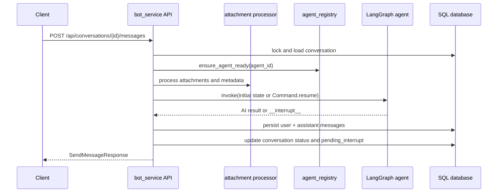
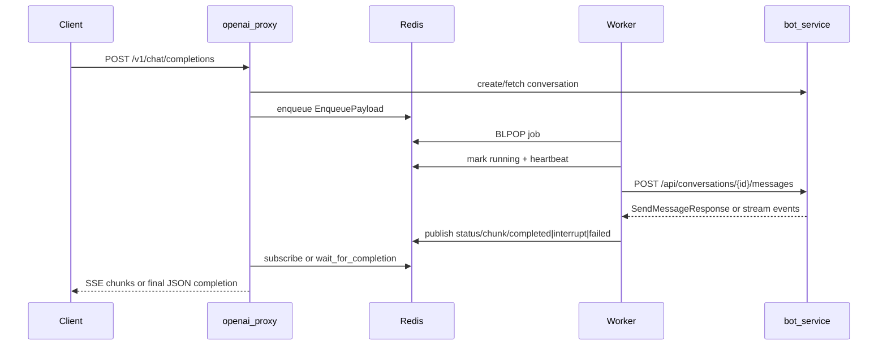
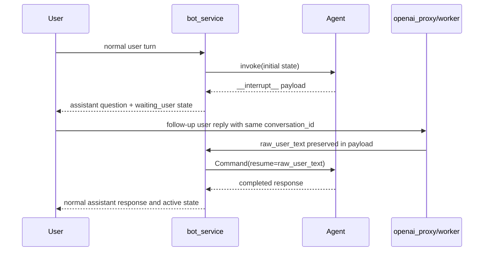

# Runtime Flows

Back to the [documentation index](../index.md).

## Synchronous `bot_service` execution flow

This is the direct internal path through `POST /api/conversations/{id}/messages`.

### Conversation statuses

- `pending`
  - Conversation exists, but the selected agent is still initializing.
- `active`
  - Conversation is ready for a normal user turn.
- `waiting_user`
  - The previous agent turn returned an interrupt and the next user message will resume the graph.

## Asynchronous proxy -> Redis -> worker -> bot flow

This is the path behind `POST /v1/chat/completions`.

### Queue job stages

- `queued`
- `running`
- `streaming`
- `completed`
- `failed`
- `interrupted`

### Queue event types

- `status`
- `chunk`
- `completed`
- `failed`
- `heartbeat`
- `interrupt`

## Interrupt / resume lifecycle

The platform supports LangGraph interrupts in both direct and proxy paths.

### Interrupt persistence rules

- The assistant message metadata stores `agent_status=interrupted`.
- Conversation metadata stores `pending_interrupt`.
- The next user turn is converted into `Command(resume=raw_user_text)` instead of a new ordinary message state.

## Startup and readiness flow

- `bot_service` startup
  - Initializes SQL models and calls `agent_registry.preload_all()`.
- `openai_proxy` startup
  - Starts the bot client and Redis task queue client.
- `task worker` startup
  - Connects to Redis and `bot_service`, then starts the main loop and watchdog.

## Operational behavior worth documenting

- Heartbeats
  - Workers refresh `last_heartbeat` and publish `heartbeat` events during long jobs.
- Watchdog
  - The watchdog marks stale jobs as failed when heartbeat age exceeds `TASK_QUEUE_HEARTBEAT_STALE_AFTER_SECONDS`.
- Attachment handling
  - The proxy hydrates `http(s)` and `data:` attachment URLs into inline payloads.
  - `bot_service` either forwards raw attachments or converts unsupported ones into text segments before invoking an agent.
